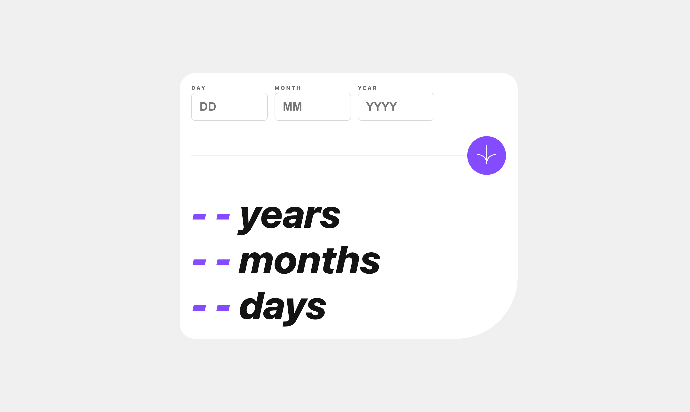

# Frontend Mentor - Age calculator app solution

This is a solution to the [Age calculator app challenge on Frontend Mentor](https://www.frontendmentor.io/challenges/age-calculator-app-dF9DFFpj-Q). Frontend Mentor challenges help you improve your coding skills by building realistic projects. 

## Table of contents

- [Overview](#overview)
  - [The challenge](#the-challenge)
  - [Screenshot](#screenshot)
  - [Links](#links)
- [My process](#my-process)
  - [Built with](#built-with)
  - [What I learned](#what-i-learned)
  - [Continued development](#continued-development)
- [Author](#author)

## Overview

### The challenge

Users should be able to:

- View an age in years, months, and days after submitting a valid date through the form
- Receive validation errors if:
  - Any field is empty when the form is submitted
  - The day number is not between 1-31
  - The month number is not between 1-12
  - The year is in the future
  - The date is invalid e.g. 31/04/1991 (there are 30 days in April)
- View the optimal layout for the interface depending on their device's screen size
- See hover and focus states for all interactive elements on the page

### Screenshot

### Links

- Solution URL: [https://github.com/Vyonyx/AgeCalculator-feMentors-Vue](https://your-solution-url.com)
- Live Site URL: [https://vyonyx.github.io/AgeCalculator-feMentors-Vue/](https://your-live-site-url.com)

## My process

### Built with

- Semantic HTML5 markup
- SCSS/SASS
- Flexbox
- Mobile-first workflow
- [Vue](https://vuejs.org/) - JS Frontend Library

### What I learned

Managing separate error messages for each form control was difficult because each error message was unique and required separate validation.
I chose to throw errors during the validation step and catch those error messages to perform custom error state changes that allowed enough flexibility to accomodate unique error messages for each form.
The solution is not the most elegant solution but this process has inspired me to research patterns for handling custom error messages and validation.

### Continued development

When comparing the design file to the final outcome, I need to:

- Reduce the gap between the bold letters (calculator output)
- Make bold text a heavier font
- Increase card padding
- Increase font sizes for all text

## Author

- Website - [Portfolio](https://portfolio-vyonyx.vercel.app/)
- Frontend Mentor - [@Vyonyx](https://www.frontendmentor.io/profile/Vyonyx)
